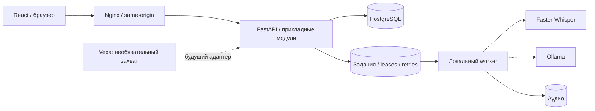

# Обновление: RAG по встречам

Реализован отдельный модуль parent/child/neighbor RAG на PostgreSQL + pgvector, worker и панель вопросов с цитатами. [Текущее решение, настройки и границы](rag.md). Ниже сохранено описание исходного foundation-этапа; его ограничения по отсутствию AI API больше не описывают стандартный OpenAI-профиль.

# AI Meeting Intelligence: архитектура

Статус: архив и локальная транскрибация, 11 сентября 2026. Основной сценарий из ТЗ — локальный исходник встречи → структурированный протокол → проверенные поручения и экспорт. Архитектура рассчитана на развитие этого сценария; реализованы доступ, хранение текстовых исходников и локальная транскрибация аудиофайлов. Подробности текущего конвейера: [распознавание](transcription.md).

## Решение

Модульный монолит на Python и самостоятельное React-приложение. Python выбран для прямого подключения локальных STT/LLM-библиотек. HTTP API отвечает за короткие операции; длительное распознавание и генерация будут работать в отдельных процессах с собственным жизненным циклом. Разделение процессов не требует разделения доменной модели на микросервисы.

Сплошные связи реализованы для архива и распознавания. Пунктир обозначает будущий протокол и необязательный захват встреч. Конфигурация отдельно добавленного RAG описана в `docs/rag.md`.

## Стек и ответственность

| Область | Выбор | Почему |
| --- | --- | --- |
| UI | React, TypeScript, Vite | Локальная SPA без потребности в SEO/SSR; независимая сборка статических ресурсов |
| Маршруты | TanStack Router | Типизированные переходы и параметры маршрутов |
| Данные браузера | TanStack Query | Кеш сервера, жизненный цикл запросов, обновления после мутаций |
| Формы | React Hook Form + Zod | Согласованная валидация и управляемые ошибки без общего store для форм |
| Доступные диалоги | Radix UI | Готовое управление фокусом и клавиатурой для подтверждения удаления |
| API | FastAPI + Pydantic | Проверяемые входы/выходы, OpenAPI как источник транспортного контракта |
| БД | PostgreSQL + SQLAlchemy + Alembic | Транзакции, ограничения, предсказуемые миграции |
| Доступ | Argon2 + серверные сессии | Пароль не хранится открыто; сессии можно отзывать, токен не доступен JavaScript |
| Развёртывание | Docker Compose + Nginx | Воспроизводимые сервисы, один origin и отсутствие публичных портов БД/API |

Версии зависимостей фиксируются lock-файлами, базовые Docker-образы — digest. Обновление образа требует явной смены digest и проверки CI. Не добавляем Redux для серверного кеша, Next.js ради статической панели, Redis без задачи очереди, MinIO без нужды в объектном хранилище или Kubernetes без эксплуатационного основания.

## Границы модулей

- **Identity:** пользователи, проверка паролей, серверные сессии, ограничение попыток входа. Bootstrap выполняется отдельной командой.
- **Meetings:** метаданные встречи, принадлежность пользователю, неизменяемый текст исходника. Чтение и удаление всегда проверяют владельца; чужой ID возвращает 404.
- **Processing (слой 2):** задания с идентификатором входной версии, идемпотентностью, lease, heartbeat, ограничением повторов и отменой. Статусы выполнения принадлежат заданию. Встреча не становится «готовой» просто после сохранения текста.
- **Intelligence (слой 3):** адаптер локальной LLM, схемы summary/decisions/topics/questions/action items и ссылки на исходные сегменты. Неозвученный исполнитель или срок остаётся неизвестным. Вывод модели рассматривается как данные; содержимое транскрипта не управляет инструментами или политиками системы.
- **Exports (слой 3):** отдельные преобразования проверенного протокола в CSV/JSON/PDF; экранирование CSV-формул, доступ по владельцу, версия формата.
- **Capture integrations (дополнительно):** Vexa получает запись встречи и переводит её в собственный формат импорта, не определяет доменную модель продукта.

## Входы и версии

`Meeting` — рабочий объект пользователя. Исходный транскрипт и будущий AI-протокол имеют разные назначения. В первом слое текст нельзя менять после создания. При добавлении редактирования требуется отдельная ревизия: задание привязано к версии/хешу исходника, модели, конфигурации и версии промпта. Результат старого задания не перезаписывает результат новой версии. Аудиофайлы появятся с отдельным lifecycle и потоковой загрузкой, а не в JSON или памяти API целиком.

Поручения не являются произвольными строками summary: у них должны быть собственные ID, исполнитель/срок/приоритет с неизвестными значениями, доказательство в транскрипте и состояние пользовательской проверки. Модель не должна додумывать договорённости.

## Локальность и Vexa

В исполняемом слое 1 нет внешних AI API, аналитики, CDN-шрифтов и облачных ресурсов интерфейса. Образы и пакеты скачиваются при сборке; уже собранное окружение работает локально. Сети API и базы объявлены `internal`. У web есть отдельная edge-сеть для публикации порта на `127.0.0.1`; исходящая сеть самого web-контейнера доступна, приложение её не использует. Это не является сертификацией полностью изолированной среды: такой прогон проверяется отдельно после подключения моделей.

Vexa — **необязательный будущий источник записи**, выключенный по умолчанию. ТЗ требует прежде всего загрузку аудио/текста, поэтому полный стек ботов сейчас не запускается. Vexa self-hosted не равнозначна проверенному disconnected deployment; это ограничение прямо указано в [официальном описании развёртывания](https://docs.vexa.ai/deployment). Для будущего адаптера нужны allowlist локальных адресов, таймауты, дедупликация provider/source ID и перевод сегментов в собственную схему. Подключение к видеоконференции по своей природе требует сети и не входит в offline-путь обработки файлов.

## Следующие слои

1. **Основа:** доступ, текстовые встречи, миграции, сборка, контейнеры и проверки. Реализовано.
2. **Локальный конвейер:** реализованы MP3/WAV/M4A, ограниченное декодирование, Faster-Whisper, очередь с восстановлением, отмена и progress. Стандартный Compose работает на CPU; GPU — отдельная настройка.
3. **Протокол:** Ollama, структурированный вывод, привязки к исходнику, поручения, ручная проверка, CSV/JSON/PDF.
4. **Эксплуатационная приёмка:** RU/KK/EN и смешанная речь, измерения качества/задержек, прерывание worker, backup/restore, обновление моделей, offline-прогон, TLS и модель ролей для командного размещения.

Диаризация, чат по встрече и Vexa — отдельные расширения после основного пути. Слой распознавания реализован в модуле `transcription`; схема выше сохраняет первоначальные архитектурные границы. Отдельные расширения не входят в распознавание.
