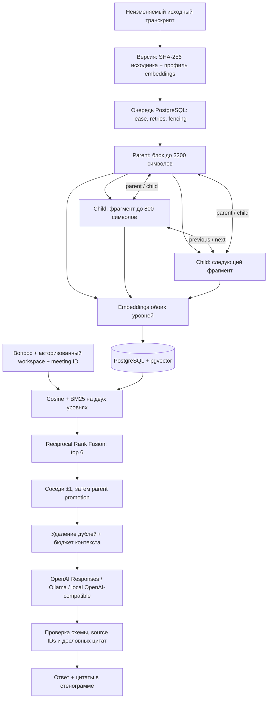

# RAG по встрече: архитектура и запуск

Реализован модуль `apps/api/src/aimeet_api/modules/rag`. Вход — сохранённая стенограмма одной встречи, включая результат локальной транскрибации. Выход — ответ с дословными цитатами и координатами в исходнике. Каждый вопрос независим: история в панели живёт до перезагрузки, сервер пока не хранит разговор и не разрешает ссылки вроде «а он когда?» через предыдущие вопросы.

По запросу владельца продукта дефолт — **OpenAI `gpt-5.6-luna`, `reasoning.effort=max`**. Требование исходного PDF о локальности выполняется отдельным offline-профилем; облачный профиль ему не соответствует. Наличие адаптера не подтверждает доступ к модели на конкретном API-аккаунте.

## Архитектурное решение

Одна PostgreSQL с pgvector хранит документы, embeddings, структурный граф и задания. Для текущего ограничения в 200 000 символов на встречу точный cosine-поиск по заранее выбранной версии встречи практичнее отдельной graph database и ANN-индекса. Не требуется согласовывать состояние нескольких хранилищ, нет потери recall из-за фильтрации после ANN. Это граф структуры документа, не HNSW и не автоматически извлечённый граф сущностей.



### Данные и граф

- `rag_indexes`: ID версии, SHA-256 транскрипта, профиль, состояние/lease/attempts, число узлов. Уникальность `(meeting_id, profile, source_hash)` обеспечивает идемпотентность подготовки.
- `rag_nodes`: parent/child, порядок, parent ID, текст, embedding, `start_char/end_char`. Координаты — **Unicode code points**, конец не включён; это не UTF-8 bytes и не JS UTF-16 indices. Для преобразования на frontend нужен `Array.from(text)`.
- `rag_edges`: направленные `parent`, `child`, `previous`, `next`. Соседи существуют и между родительскими блоками. Составные внешние ключи не позволяют связать узлы разных версий.
- Родители содержат **исходный текст**, а не сгенерированное summary. Для цитат нет потери точности из-за пересказа.
- Разрез предпочитает границу реплики/абзаца во второй половине окна, затем границу предложения/слова. Длинная неразрывная реплика делится с сохранением точных координат. Тематическая сегментация LLM не заявляется.
- Embeddings строятся для обоих уровней. Это увеличивает объём embedding-обработки примерно вдвое, но даёт широкие тематические и точечные попадания.
- Профиль включает provider, endpoint, модель, размерность, ручную revision, размеры окон и версию chunker. Смена LLM не перестраивает индекс. Смена embeddings, endpoint или chunker создаёт отдельную версию. При замене весов под тем же именем необходимо увеличить `RAG_EMBEDDING_REVISION`.

### Поиск и ответ

1. Проверить пользователя/workspace, выбранную встречу и наличие готовой версии для текущего исходника/профиля.
2. Получить embedding вопроса тем же профилем. Неправильная размерность, NaN/Infinity, нулевая норма, повторённые или неполные индексы ответа провайдера — ошибка, а не пустая выдача.
3. Выполнить точный cosine-поиск в PostgreSQL и BM25 отдельно по parent/child. BM25 работает с Unicode-токенами RU/KK/EN; морфологический анализ не добавлен.
4. Объединить рейтинги RRF (`k=60`, вес child=1, parent=0.8). Дефолт: по 24 кандидата, 6 начальных попаданий, cosine threshold 0.25.
5. Добавить ближайшие соседние узлы, затем по возможности заменить дочерние фрагменты родительскими. Это оставляет место для исправления в следующей реплике на границе блока. Дедупликация удаляет вложенные диапазоны. Порядок финального контекста хронологический.
6. Ограничить контекст 18 000 символов, учитывая резерв на метаданные. Это ограничение символов, не точная токенизация; параметры требуют калибровки под локальную модель.
7. Отправить источники как недоверенные данные отдельно от инструкции. Инструментов у отвечающей модели нет. В OpenAI используется `store=false` и strict JSON Schema, без неявного cloud fallback.
8. Проверить каждую цитату: ID входит в переданные источники, текст дословно существует, координаты вычисляются сервером. Неизвестные ID и выдуманные цитаты отклоняются целиком с `UNGROUNDED_MODEL_RESPONSE`.
9. При отсутствии источников генерация вообще не вызывается. `insufficient_evidence` означает недостаточность найденного контекста, а не доказанное отсутствие ответа во всей встрече.

**Граница гарантии:** проверка цитаты доказывает её происхождение, но не семантическое следование произвольного утверждения из цитаты. Ошибка в интерпретации, спикере или отрицании всё ещё возможна. Нужна оценка реальных моделей на размеченных встречах. Threshold/RRF/window defaults — инженерная отправная точка, а не измеренный оптимум.

### Надёжность и доступ

Подготовка выполняется отдельным `rag-worker`, не FastAPI BackgroundTasks. Claim использует атомарный compare-and-swap; два worker не владеют одним актуальным lease. Heartbeat продлевает lease перед каждым embedding-батчем из 16 узлов. Lease длиннее provider timeout. Завершившийся старый worker не может опубликовать результат после смены токена. После сбоя процесса lease истекает, задание забирается повторно; retry ограничен, с задержкой для временных ошибок. Пользователь может явно повторить failed-задание.

Сеть вызывается вне длинной транзакции. Все nodes/edges и статус `ready` публикуются одной транзакцией. Полузаполненный индекс не доступен читателям. Источники старого профиля не подмешиваются в новый. Удаление встречи каскадно удаляет её индексы, векторы и связи. Старые версии сохраняются до удаления встречи; отдельного retention/GC пока нет.

Все RAG endpoints проверяют workspace до вызова provider. ID чужой встречи даёт 404. POST требует существующую CSRF-защиту. Provider endpoint задаётся оператором сервера, не HTTP-запросом пользователя. Ключи не возвращаются в API; provider response bodies/исходники не пишутся в ошибки и логи. HTTP-клиент отключает redirects и ambient proxy; ответ ограничен 8 MB. Chat не имеет автоматического retry, чтобы не дублировать дорогую генерацию; worker повторяет только временные ошибки.

## OpenAI — дефолт

В `.env`:

```dotenv
RAG_OFFLINE=false
RAG_LLM_PROVIDER=openai
RAG_LLM_MODEL=gpt-5.6-luna
RAG_REASONING_EFFORT=max
OPENAI_API_KEY=your-api-key
RAG_EMBEDDING_PROVIDER=openai
RAG_EMBEDDING_MODEL=text-embedding-3-small
RAG_EMBEDDING_DIMENSIONS=1536
```

Запуск нового окружения: `make up`. Встреча → «Подготовить встречу для вопросов» → вопрос → раскрыть цитату. API доступен и без ключа, но подготовка/чат вернут `OPENAI_KEY_REQUIRED`; фальшивого ответа нет. При подготовке обеих уровней в OpenAI передаётся вся стенограмма; при вопросе — вопрос и отобранный контекст. Это отражено в интерфейсе до действия.

`max` может заметно увеличивать задержку; Nginx даёт RAG-запросу до 600 секунд, provider timeout — 180 секунд на отдельный вызов. Доступ к API-ключу, модели и биллингу проверяется отдельным live smoke, не по наличию модели в каталоге Codex.

**Обновление существующего окружения:** сначала `make backup` и проверка восстановления. Образ PostgreSQL заменён на закреплённый pgvector 0.8.6 / PostgreSQL 17. Не переходить через major PostgreSQL и не удалять старый volume. Перед обновлением рабочих данных отрепетировать восстановление dump в новый pgvector-кластер: исходный образ Alpine и новый образ могут иметь разные locale/collation. Миграция `0003_meeting_rag` включает расширение `vector`; для внешней управляемой БД это может требовать предварительной установки оператором. Откат `0003 -> 0002` удаляет только данные RAG и оставляет транскрипты/расширение.

## Ollama и полный локальный путь

Для Ollama, уже работающей на хосте Docker Desktop:

```dotenv
RAG_OFFLINE=true
RAG_LLM_PROVIDER=ollama
RAG_LLM_MODEL=qwen3:8b
RAG_EMBEDDING_PROVIDER=ollama
RAG_EMBEDDING_MODEL=bge-m3
RAG_EMBEDDING_DIMENSIONS=1024
RAG_LOCAL_URL=http://host.docker.internal:11434
OPENAI_API_KEY=
```

`qwen3:8b` / `bge-m3` — пример конфигурации, не результат сравнительного теста. Веса должны быть заранее скачаны; фактическая размерность ответа сверяется. Модель должна поддерживать JSON Schema. Для Ollama используются native `/api/embed` (`truncate=false`) и `/api/chat`, чтобы обрезка embeddings не происходила незаметно.

Этот вариант запрещает cloud adapters на уровне приложения, но базовый Compose сохраняет сеть egress. Для изоляции контейнеров используется `compose.rag-offline.yaml` (Compose ≥ 2.24.4):

```sh
# Предварительно задать OLLAMA_IMAGE (проверенный tag/digest) и OLLAMA_MODELS_DIR
# с уже подготовленной папкой .ollama, включающей модели и служебный ключ Ollama.
docker compose -f compose.yaml -f compose.rag-offline.yaml up --build -d
```

Overlay фиксирует локальные provider settings, очищает OpenAI key у API/RAG-worker и заменяет их сети на internal. Ollama подключена только к internal data-сети, модельный каталог монтируется read-only. Подбор CPU/GPU, конкретного image digest и памяти зависит от оборудования; GPU passthrough в overlay не включён. Во время сборки нужны заранее доступные образы/пакеты; offline inference и offline image build — разные проверки. Для режима без внешней сети нужно также проверить поведение выбранного model server, наличие весов и реальный сетевой трафик. Веб-сервис сохраняет edge-сеть для публикации UI.

## Локальный OpenAI-совместимый сервер

```dotenv
RAG_OFFLINE=true
RAG_LLM_PROVIDER=local_openai
RAG_LLM_MODEL=your-served-chat-model
RAG_LOCAL_URL=http://127.0.0.1:8001/v1
RAG_EMBEDDING_PROVIDER=local_openai
RAG_EMBEDDING_MODEL=your-served-embedding-model
RAG_EMBEDDING_LOCAL_URL=http://127.0.0.1:8002/v1
RAG_EMBEDDING_DIMENSIONS=1024
```

Это пример для запуска API непосредственно на хосте; внутри Docker `127.0.0.1` указывает на сам контейнер. Используйте Docker service name/доступный частный IP или `host.docker.internal`. Отдельный embedding endpoint позволяет использовать два инстанса vLLM/llama.cpp. Требуются `/embeddings` и `/chat/completions` с `response_format=json_schema`; отсутствие поддержки — явная ошибка. `RAG_LOCAL_API_KEY` при необходимости используется для обоих локальных endpoint. URL embeddings при отсутствии наследует `RAG_LOCAL_URL`.

Offline-настройки отвергают облачные provider и публичные hostname. Локальный OpenAI-совместимый сервер сам должен исполнять модели локально. Настройка `local_openai` сама по себе не доказывает, что произвольный сторонний proxy не пересылает данные.

## API

| Метод | Путь после `/api/v1` | Назначение |
| --- | --- | --- |
| GET | `/rag/config` | Публичная часть настроек без секретов |
| POST | `/meetings/{id}/rag/index` | Идемпотентная постановка на подготовку / retry failed |
| GET | `/meetings/{id}/rag/index` | Состояние актуального профиля и исходника |
| GET | `/meetings/{id}/rag/graph` | Узлы/связи/диапазоны без embeddings и текста |
| POST | `/meetings/{id}/rag/search` | Найденный контекст без генерации |
| POST | `/meetings/{id}/rag/chat` | Ответ с проверенными цитатами |

Поиск и чат принимают `{"question":"Какой бюджет согласовали?"}`. Полный контракт генерируется в `packages/contracts/openapi.json`. Ошибки provider отличаются от отсутствия evidence; UI переводит коды в понятные сообщения и сохраняет вопрос после ошибки.

## Проверки

```sh
cd apps/api
uv sync --frozen --group dev
uv run ruff check .
uv run pytest
# Для native pgvector и изолированных схем: отдельная тестовая PostgreSQL с vector extension
TEST_DATABASE_URL=postgresql+psycopg://... uv run pytest
DATABASE_URL=postgresql+psycopg://... uv run alembic upgrade head
DATABASE_URL=postgresql+psycopg://... uv run alembic check
```

Тесты `test_rag.py` / `test_rag_providers.py` проверяют lossless chunking, граф/соседей через границу parent, бюджет/дедупликацию, корректировки, отсутствие evidence, точные цитаты, tenant isolation, CAS/lease fencing, atomic publication, retries, версии исходника/модели, каскадное удаление, OpenAI Luna/max wire contract, локальные API, некорректные vectors/envelopes, redaction и запрет redirect/cloud fallback. Провайдеры в этих тестах заменены детерминированными double/HTTP transport. Это проверка системы, а не измерение семантического качества LLM.

Следующий gate перед эксплуатацией: на настоящих моделях проверить RU/KK/EN, смену спикера, отрицания, исправления сумм/сроков и вопросы без ответа; измерить source recall, точность смысловой опоры, p50/p95 latency и стоимость. Не добавлять cross-encoder, отдельную graph database или multi-agent loop до измеренного сбоя текущего retrieval. Общий executive summary всей встречи требует отдельного полного прохода по блокам: top-k RAG не гарантирует полноту протокола.

## Источники решений

- [OpenAI GPT-5.6 Luna: model ID, max reasoning, endpoints](https://developers.openai.com/api/docs/models/gpt-5.6-luna).
- [OpenAI Structured Outputs](https://developers.openai.com/api/docs/guides/structured-outputs).
- [pgvector: exact/approximate search, filtering, vector dimensions](https://github.com/pgvector/pgvector).
- [Ollama embeddings API](https://docs.ollama.com/api/embed) и [chat API](https://docs.ollama.com/api/chat).

## Чат по всем встречам

Отдельная вкладка **Чат** (`/chat`) ищет по существующим встречам текущего
рабочего пространства. Пользователь только задаёт вопрос: поиск сам ставит
отсутствующие или неудачные индексы в очередь RAG и дожидается обработки
стенограмм через `rag-worker`. Повторная отправка по готовым индексам не запускает
подготовку заново. Ожидание обработки ограничено тремя минутами; при превышении
можно повторить вопрос, а фоновые задания продолжают работать.

В чате нет требования добавлять встречи или нажимать «Подготовить». Если встреч
или доступных стенограмм нет, ответ честно сообщает об отсутствии материала для
поиска. Встречи без стенограммы и стенограммы длиннее существующего лимита
200 000 символов не участвуют в поиске; неполный охват обозначается в ответе.

API (те же сессия и CSRF, что и у вопросов к одной встрече):

- `GET /api/v1/rag/index` — количество всех, готовых, ожидающих, неудачных,
  неподготовленных и недоступных встреч.
- `POST /api/v1/rag/index` — подготовить доступные стенограммы рабочего пространства.
- `POST /api/v1/rag/chat`, `{ "question": "На какой встрече обсуждали бюджет?" }` —
  общий ответ с `claims`, дословными цитатами, `sources` и `coverage`.
  Каждый источник содержит `meeting_id`, `meeting_title` и `meeting_created_at`
  (дата добавления в архив, не подтверждённая дата проведения встречи).

Общий поиск использует один embedding вопроса, гибридное ранжирование по готовым
актуальным индексам и общий лимит контекста. Расширение соседей и родительских
фрагментов сохраняется; дедупликация учитывает индекс встречи, поэтому одинаковые
смещения текста в разных встречах не схлопываются. Перед и после обращения к
провайдеру проверяются доступность встреч и актуальность индексов. Дословность цитат проверяется по тексту соответствующего источника. Поиск по одной встрече остаётся доступным.

Чат работает как ассистент: `POST /api/v1/assistant/chat` принимает `question` и
`history` (роли `user`/`assistant`, максимум 20 сообщений и 40 000 символов).
Модель отвечает на приветствия, обычные вопросы и справку по Soyle напрямую,
без чтения встреч, эмбеддингов или подготовки индексов. Для вопроса об архиве
она возвращает действие `search_meetings` с самостоятельным поисковым запросом,
уточнённым по истории диалога; клиент выполняет существующий RAG-поиск с проверкой цитат.
Ассистент помогает советами и черновиками, а по явному запросу создаёт дополнительные задачи в канбане.

История каждого чата сохраняется на сервере отдельно для текущего пользователя. Для продолжения диалога передаются до десяти
последних пар сообщений в пределах указанного лимита. «Новый чат» создаёт отдельный диалог со своим контекстом.
Нагрузка общего точного поиска растёт с объёмом архива: стенограммы проверяются
на актуальность, узлы загружаются для BM25.
Для больших архивов потребуется отдельный замер и оптимизация retrieval.

Проверки: `apps/api/.venv/bin/python -m pytest apps/api/tests/test_workspace_rag.py
apps/api/tests/test_rag.py apps/api/tests/test_rag_providers.py` (одной командой).
Интеграционные тесты используют отдельную БД и детерминированного провайдера;
они не доказывают качество ответов внешней модели.

Общий чат также получает каталог встреч: точное число записей в рабочем
пространстве и названия/даты добавления последних 20 встреч. Эти источники
(`catalog_sources`, ссылки `M0`–`M20`) отделены от цитат из стенограмм и позволяют
отвечать о наличии встреч даже без релевантного фрагмента разговора. Название
встречи само по себе не доказывает содержание обсуждения. Каталог повторно
проверяется после генерации, чтобы не вернуть устаревшие данные при изменении
архива. Ответы генерируются настроенным RAG-провайдером; в локальном API проверены
`gpt-5.6-luna` и `reasoning_effort=max`.

## Дополнительные источники и действия ассистента

Общий поиск читает сохранённые итоги и карточки канбана дополнительно к стенограммам
и каталогу встреч. В контексте есть названия, описания, типы карточек, статусы,
ответственные, сроки и отметки проверки. Карточки читаются непосредственно из БД:
изменение статуса не требует повторной индексации стенограммы. Ответ различает
источник «Канбан», «Итоги» и дословную цитату. Ссылки открывают соответствующую
вкладку встречи. Устаревшие непроверенные результаты ИИ исключаются; ручные и
проверенные карточки сохраняются. Выборка ограничена 24 источниками и 14 000
символов сериализованного контекста; неполный охват явно обозначается.

По явному запросу пользователя ассистент может создать до десяти дополнительных
задач в существующих канбанах. Он уточняет неоднозначную встречу, не изменяет и не
удаляет существующие карточки. Модель предлагает план; сервер проверяет доступ к
встречам, ограничения полей и лимит карточек. Запись всего набора и результат
операции сохраняются одной транзакцией. `request_id` предотвращает повторное
создание при повторе HTTP-запроса. Если указан `conversation_id`, завершённое
действие одновременно сохраняется в переписке, даже если соединение оборвалось.

В интерфейсе показан процесс создания, а подтверждение и карточки со ссылками на
канбан появляются после сохранения. При ошибке вопрос остаётся для повтора.
История чатов хранится в таблицах `assistant_conversations` и
`assistant_conversation_turns`; каждый диалог доступен только создавшему его
пользователю в соответствующем рабочем пространстве. «Новый чат» создаёт отдельный
диалог, список позволяет переключаться; переписка сохраняется после перезагрузки.
В модель передаётся только ограниченная история выбранного чата. Исторические
ответы не заменяют проверку актуальных данных встреч.

Новые маршруты:
- `POST /api/v1/assistant/tasks` — создание задач с идентификатором операции.
- `GET/POST /api/v1/assistant/conversations` — список и создание чатов.
- `GET /api/v1/assistant/conversations/{id}` — выбранный диалог.
- `POST /api/v1/assistant/conversations/{id}/turns` — сохранение завершённой пары сообщений.

Для обновления БД требуется миграция `0005_assistant_tasks`.

### Отправка и переход между вкладками

Вопрос сначала сохраняется через
`POST /api/v1/assistant/conversations/{id}/turns/pending`, затем начинается обработка.
Незавершённая запись содержит состояние `pending`/`failed` и этап `thinking`/`creating`.
Завершение заменяет её результатом, сохраняя идентификатор и время вопроса.
Позднее обновление статуса не может перезаписать готовый ответ.

Обработка выполняется общим клиентским runner, который продолжает работать при
переходах между страницами и чатами. При возвращении виден тот же вопрос и его
текущий статус. После полной перезагрузки сохранённый незавершённый запрос
возобновляется; уже завершённый не запускается повторно. Создание задач сохраняет
прежний идентификатор операции, поэтому повтор не дублирует карточки. Выход из
учётной записи отменяет оставшиеся клиентские запросы. Это не серверная очередь,
продолжающая выполнение при полностью закрытом браузере.

### Поток ответа и незавершённая генерация

Для OpenAI используются `POST /api/v1/assistant/chat/stream` и
`POST /api/v1/rag/chat/stream`, передающие настоящие SSE-события Responses API.
Обычный текст появляется по мере получения `response.output_text.delta`.
Для ответов о встречах сначала завершается и проверяется очередной тезис с его
цитатами, затем его текст передаётся клиенту. Полный ответ и ссылки сохраняются
только после успешного терминального события. `X-Accel-Buffering: no` отключает
буферизацию потока на nginx. Настроенные локальные провайдеры пока возвращают
полный проверенный результат в конце того же SSE-контракта.

Лимит ответа по умолчанию увеличен с 8192 до 16384; `reasoning_effort=max`
сохраняется. Исчерпание лимита отличаем кодом `MODEL_OUTPUT_LIMIT` от остальных
незавершённых ответов. Код и HTTP-статус ошибки сохраняются в записи сообщения,
так что перезагрузка больше не превращает известную ошибку в общий текст.
В журнал попадают только тип ошибки, статус, модель и счётчики токенов, без
стенограмм, тела ответа или ключей. Незавершённый поток не считается готовым ответом.

Протокол: https://developers.openai.com/api/docs/guides/streaming-responses
